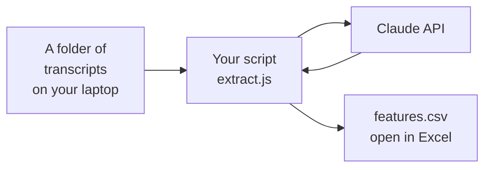

# 201 — Make it real
{: .no_toc }

**Time: a weekend. Cost: a few dollars in API credits. Prior experience required: completed [101](../101-your-first-ai-tool/), have a working laptop.**
{: .fs-5 .fw-300 }

By the end of this page you'll have a real script running on your laptop that reads call transcripts from a folder, extracts feature requests using Claude, and saves them to a CSV file you can open in Excel or Google Sheets. **No more pasting one at a time into a chat window.** This is your first "real" tool.
{: .fs-5 .fw-300 }

<details markdown="block">
<summary><strong>Table of contents</strong></summary>

1. TOC
{:toc}

</details>

---

## What you're building



Imagine you drop ten call transcripts into a folder. You run one command. Thirty seconds later, you have a spreadsheet with every feature request from all ten calls, labeled and organized. **That's the 201 deliverable.**

It's not glamorous. There's no website yet. But it's the moment when you stop doing the work yourself and your tool starts doing it for you. Everything in 301 — the database, the dashboard, the scheduled jobs — is just *making this script run automatically, for more people, more often.*

---

## Setup (15 minutes)

You'll install three things. Take your time. If you've never installed developer tools, this part feels disorienting — that's fine, it's a one-time thing.

### 1. Node.js

Node lets you run JavaScript on your computer (instead of just in a web browser). It's the runtime our script will use.

1. Go to [nodejs.org](https://nodejs.org)
2. Download the **LTS** version (the one labeled "Recommended for Most Users")
3. Run the installer. Click through the defaults.

To check it worked: open your **Terminal** app (on Mac: ⌘+Space, type "Terminal", press Enter. On Windows: search "Command Prompt" or "PowerShell").

Type:

```bash
node --version
```

You should see something like `v20.11.0`. If you see that, you're good. If you see "command not found," try restarting your terminal. If still broken, ask Claude: *"I just installed Node.js but `node --version` shows 'command not found' on [Mac/Windows]. How do I fix this?"*

<details markdown="block">
<summary><strong>Why we need Node at all</strong></summary>

JavaScript was originally only for web pages — running inside a browser. Node took the JavaScript engine out of the browser so you could use the same language to write programs that run on your computer (or a server). Almost every web-related tool you'll touch as a builder runs on Node.

You don't need to learn JavaScript right now. Claude writes it. You just need the runtime installed so the code can execute.

</details>

### 2. Cursor

Cursor is a code editor with Claude built in. Think of it as Claude Desktop, but instead of just chatting, the chat can also read and write files on your computer.

1. Go to [cursor.com](https://cursor.com)
2. Download for your OS
3. Install and open it
4. Sign in (you can use Google)
5. When asked to install command-line tools, say **yes**

The first time you open Cursor, it'll look intimidating. It's just a code editor — a fancy text editor that knows what programming languages look like. **You won't type code into it.** You'll type into the chat panel on the right side, and Claude will write the code for you.

<details markdown="block">
<summary><strong>Cursor vs. VSCode vs. Claude Code — which should I use?</strong></summary>

All three are good. They differ in feel:

- **Cursor** (recommended for beginners): Looks and feels like a code editor with a chat assistant. The chat is the star. Familiar UI if you've ever seen VSCode.
- **Claude Code** (CLI, also great): Lives in the terminal. More powerful for agentic work — Claude can run commands, search files, write tests, all on its own. Steeper if you've never used a terminal.
- **VSCode + Copilot or Claude extensions**: Most flexible but most config.

You can switch later. Cursor is the smoothest "start here."

</details>

### 3. A Claude API key

The 101 used Claude Desktop, which is included in your Claude.ai subscription. To call Claude from your *own* code, you need an API key. This is how you pay for Claude programmatically — by the token (tiny units of text).

1. Go to [console.anthropic.com](https://console.anthropic.com)
2. Sign in with the same account you use for Claude.ai
3. Go to **Settings → Billing** and add a credit card. **Add $5 to start.** That's more than enough for the entire 201.
4. Go to **Settings → API Keys** and click **Create Key**. Name it `build-with-claude`.
5. **Copy the key.** It starts with `sk-ant-...`. You'll only see it once.
6. Paste it somewhere safe for the next 10 minutes (a sticky note, a Notes app — we'll move it somewhere permanent in a second).

{: .warning }
> **The API key is a password.** Anyone who has it can spend your money. Never put it in a screenshot, a public file, or a chat message. We'll store it in a "secret" file that doesn't leave your computer.

<details markdown="block">
<summary><strong>How much will this actually cost?</strong></summary>

For the 201 specifically: pennies. Maybe $0.10 total to extract feature requests from a dozen test calls.

A single call transcript of ~1,000 words run through Claude Haiku (a small, fast Claude model) costs roughly $0.001 — one tenth of a cent. Even with Claude Sonnet (the smarter, more expensive model), you're at about $0.01 per call.

For Call Intelligence at LiveSchool, we process hundreds of calls a week and spend less than $50/month total. AI is dramatically cheaper than people assume.

</details>

---

## The first script (15 minutes)

We're going to make Cursor build us the script. Open Cursor.

### Make a project folder

1. In Cursor, click **File → Open Folder**
2. Navigate somewhere sensible (your Desktop is fine), and click **New Folder**
3. Name it `call-extractor` and open it

You now have an empty project folder open in Cursor.

### Open the chat

On the right side of Cursor, there's a chat panel. (If you don't see it, click the chat icon in the right sidebar, or press ⌘+L on Mac / Ctrl+L on Windows.)

**Make sure the model is set to Claude Sonnet** (the dropdown above the chat input).

### Your first build prompt

Type this into the Cursor chat:

> I'm building a simple Node.js script that reads a folder of customer call transcripts (`.txt` files), sends each one to the Claude API, and extracts feature requests as structured data. For now, just write the basics:
>
> 1. A file called `extract.js` that:
>    - Reads all `.txt` files from a `./transcripts/` folder
>    - For each one, calls the Claude API with a prompt asking for feature requests as JSON
>    - Writes the combined results to `features.csv`
> 2. A `package.json` with the right dependencies (`@anthropic-ai/sdk`, `csv-writer`)
> 3. A `.env` file (with placeholder for the API key) and a `.gitignore` that excludes `.env` and `node_modules`
> 4. A `README.md` with setup steps
> 5. A `transcripts/` folder with one sample `.txt` file inside (the ABC Elementary call I'll provide separately)
>
> Use the latest stable Claude Sonnet model. Each item in the JSON should have: type (feature_request/bug/feedback), summary, detail, urgency (low/medium/high), category, quote, and school_name.
>
> Don't write all the code at once. Walk me through it file by file, explaining as you go. I'm new to this.

Send it.

Cursor will start writing files in your project. Watch the left sidebar — files will appear. The chat will narrate what it's doing.

<div class="image-placeholder" markdown="0">
<div>
<strong>Screenshot slot: a real Cursor chat</strong>
A snapshot of the chat panel will go here — the prompt above on the right, Claude's response writing files on the left, an "Apply" button visible. This is the visual a beginner needs to see: <em>"oh, this is what directing Claude looks like."</em>
</div>
</div>

{: .tip }
> **The single most important habit:** read what Claude is writing as it writes it. You don't need to understand every line. You need to understand the *shape* — what file is this, what does it do, what does each section accomplish. Treat Claude like a smart coworker pair-programming with you. Ask "why" liberally.

### When Cursor asks to apply changes

Cursor will create files in batches and ask "Apply?" Click **Apply** for each one. This puts the code into your project. You'll see files appear: `extract.js`, `package.json`, `.env`, `.gitignore`, `README.md`, `transcripts/sample-call.txt`.

<details markdown="block">
<summary><strong>What if the code looks different from what I described above?</strong></summary>

It might. Claude is non-deterministic — same prompt, different runs, slightly different output. **That's okay.** As long as the general shape is right (one main script, a package.json, an env file, a transcripts folder), you're fine.

If something is wildly wrong — say it wants you to install Python instead of Node, or it builds a totally different feature — just tell it: *"Wait, this isn't what I wanted. Let me clarify: [your clarification]. Please start over."* You won't break anything.

</details>

---

## Run your first extraction (10 minutes)

Now the moment of truth.

### Put the API key in `.env`

Open the file called `.env` in Cursor. You'll see something like:

```
ANTHROPIC_API_KEY=your-key-here
```

Replace `your-key-here` with the actual key you copied earlier (starts with `sk-ant-`). Save the file (⌘S / Ctrl+S).

{: .warning }
> **Triple-check:** the `.env` file should be in your `.gitignore`. Open `.gitignore` and confirm `.env` is listed there. If it's not, add it and save. This prevents you from accidentally publishing your API key.

### Install dependencies

In Cursor, open the **Terminal** (View → Terminal, or ⌃` on Mac, Ctrl+` on Windows).

Type:

```bash
npm install
```

You'll see a stream of installation messages. After 30 seconds or so, it'll finish. You now have the libraries the script needs.

### Add a real transcript

Open `transcripts/sample-call.txt` and paste the ABC Elementary transcript from the [101 page](../101-your-first-ai-tool/#the-sample-transcript). Save.

### Run the script

In the Cursor terminal:

```bash
node extract.js
```

If everything went well, you'll see:

```
Reading transcripts/sample-call.txt...
Calling Claude...
Extracted 4 items.
Saved features.csv ✓
```

Open `features.csv` in Cursor (or double-click it in Finder to open in Excel/Numbers/Google Sheets).

**You should see a spreadsheet with four rows** — the three feature requests and the bug from the principal's call. Each one labeled, categorized, with the verbatim quote.

You just built a tool.

{: .story }
> **From the build:** This is the moment in the Call Intelligence build where I realized this was actually going to work. I dropped two months of LiveSchool support emails into the folder, ran the script overnight, and woke up to a 4,000-row spreadsheet of every feature request our customers had ever asked for. I had been looking for that information for two years and never had it. One night of code (well, Claude's code) and there it was.

---

## When something breaks

It will. Welcome to software.

The pattern for fixing things is the same as the pattern for building things: **describe the problem to Claude in plain English, paste any error messages, ask for help.**

Some common ones:

<details markdown="block">
<summary><strong>"Cannot find module '@anthropic-ai/sdk'"</strong></summary>

You forgot to run `npm install`, or it failed. Run `npm install` again in the Cursor terminal. If it errors, copy the entire error output and paste it into the Cursor chat with: *"I got this error when running npm install. Help me fix it."*

</details>

<details markdown="block">
<summary><strong>"401 Unauthorized" or "Invalid API key"</strong></summary>

Your API key is wrong, expired, or has a typo. Check your `.env` file:
- No quotes around the key
- No spaces around the `=`
- Key starts with `sk-ant-`
- File is named exactly `.env` (with the dot, no `.txt` extension)

</details>

<details markdown="block">
<summary><strong>"The script ran but features.csv is empty"</strong></summary>

Open the script in Cursor. Paste the script's content into the chat with: *"My script ran without errors but features.csv is empty. Walk me through where the data goes and what might be wrong."* Claude will diagnose.

</details>

<details markdown="block">
<summary><strong>Generic strategy for any error</strong></summary>

1. Copy the **exact** error message
2. Paste it into Cursor chat with three pieces of context:
   - What you were trying to do
   - What you expected to happen
   - What actually happened (the error)
3. Claude will explain the cause and propose a fix
4. Apply the fix
5. Try again

This is the entire debugging process. You'll do it dozens of times. It gets faster.

</details>

---

## Iterate (an hour or two)

Now the script works. Let's make it better. Each of these is a Cursor chat prompt — one at a time, see what changes, run the script, keep what you like.

### Add real transcripts

Save a few of your own meeting notes, email threads, or calls as `.txt` files. Drop them in `transcripts/`. Run `node extract.js` again. **The same script now works on your real data.**

### Pretty-print the console output

Ask Cursor:

> When the script finishes, also print a clean summary to the console: how many feature requests, bugs, and feedback items were found, grouped by category. Use simple text, no fancy tables.

You'll have a quick at-a-glance view every time you run it.

### Deduplicate

This is where it starts to feel like Call Intelligence. Ask:

> If two items across different transcripts have similar summaries, group them together. Show the count of mentions in the CSV. Use simple string similarity, not another Claude call — we can upgrade that later.

You'll see things like *"Custom date ranges in reports (mentioned 7 times across 4 schools)."* This is the seed of the real dedup system.

### Filter

Ask:

> Add a command-line flag `--type=feature_request` so I can run `node extract.js --type=feature_request` and only see feature requests in the CSV. Same for bugs and feedback.

You're learning command-line flags by example. No book required.

### Save to Google Sheets

Ask:

> Instead of writing to a local CSV, write the results to a Google Sheet I own. Walk me through getting the API access set up.

Now your team can see the output in real time. (This is genuinely useful — many teams stop here. They never need the full 301.)

<details markdown="block">
<summary><strong>Each of these is a different way to dig deeper</strong></summary>

What you're doing in this section is *learning by extension*. You took a working thing. You asked for one more feature. You read what Claude wrote. You ran it. You noticed what changed. Repeat.

This is the single highest-leverage way to learn to build software. You'll absorb dozens of patterns — how to read environment variables, how to parse command-line arguments, how to compare strings — without ever sitting down to "learn programming." You learn it because you needed it for *this thing you were building right now*.

</details>

---

## What you actually built

You have a real piece of software running on your laptop. It:

- Takes unstructured customer calls (or emails, or meetings — anything text)
- Uses Claude to extract structured insight from them
- Saves the results somewhere you can use (CSV, Google Sheets, etc.)

This is the **core engine** of Call Intelligence. Everything from here on is "make it run somewhere other than your laptop, for more people, on a schedule, with a nice UI."

That's 301.

---

## Should you stop here?

Honestly? Maybe. Lots of teams ship internal tools that look exactly like what you just built and nothing more. **A weekend script that produces a spreadsheet is sometimes the right answer.** Don't feel obligated to keep going if this solves your problem.

You should go to 301 if:

- You want other people to be able to use the tool (not just you running it on your laptop)
- You want it to run automatically — say, every morning at 6am
- You want the data in a real database so you can build a dashboard on top of it
- You're curious how Call Intelligence is actually architected

If those don't apply: you've done it. Use what you built. Come back later.

[Go to 301 →](../301-build-the-real-thing/){: .btn .btn-primary .fs-5 }
[See the Case Study →](../case-study/){: .btn .fs-5 }

---

## Cheat sheet

For when you come back to this page later.

- **Stack**: Cursor (editor) + Node.js (runtime) + Anthropic SDK (API client) + `.env` (secret API key)
- **Pattern**: Read files → call Claude API → write structured output (CSV, JSON, Sheet)
- **Debugging mantra**: Paste error → describe context → apply fix → retry
- **Mindset shift from 101**: You're no longer doing the work yourself. You're directing a tool to do the work. Your job is to describe outcomes, read what Claude writes, and notice when something needs to change.

---

<div style="display: flex; justify-content: space-between; margin-top: 3em;">
<a href="../101-your-first-ai-tool/">← 101</a>
<a href="../301-build-the-real-thing/">301 — Build the real thing →</a>
</div>
