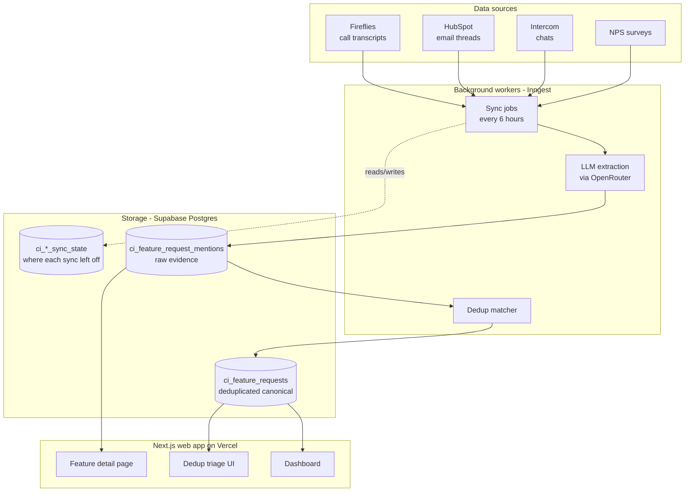

# 301 — Build the real thing
{: .no_toc }

**Time: a few weeks of evenings. Cost: ~$25/month in hosting + a few dollars in API calls. Prior experience required: completed [201](../201-make-it-real/) and shipped at least one Claude-generated script you can run end-to-end.**
{: .fs-5 .fw-300 }

By the end of this page you'll have your own version of Call Intelligence: a deployed web app with a real database, scheduled background jobs that ingest new calls automatically, and a dashboard your team can use. **This is no longer a script. This is a small SaaS app.**
{: .fs-5 .fw-300 }

This page is less a step-by-step and more a **map of the territory** with the right prompts to direct Claude through each region. The actual implementation is too long to handhold — but if you finished 201 and you can ask Claude good questions, you can build all of this.
{: .fs-5 .fw-300 }

<details markdown="block">
<summary><strong>Table of contents</strong></summary>

1. TOC
{:toc}

</details>

---

## The full architecture



Three big pieces:

1. **Data in.** Scheduled background jobs pull new calls/emails/chats from each source, run them through Claude, write the extracted items to the database.
2. **Storage and deduplication.** A Postgres database stores every individual mention. A separate process matches duplicate mentions of the same feature and groups them under a canonical row.
3. **App and dashboard.** A Next.js web app reads from the database. Product team logs in, sees a sorted, filterable list of features with mention counts, evidence quotes, urgency, and account context.

The rest of this page is how to direct Claude to build each piece.

---

## The four big concepts you're about to meet

Before we build, here's the mental model. Each of these is a category of tool that took me an embarrassingly long time to understand. I'll save you the time.

### 1. The database (Supabase)

Your CSV from 201 can hold thousands of rows. It can't be queried by multiple users at once, can't be searched efficiently, can't enforce relationships ("this mention belongs to this feature"). **A database can.**

We use **Supabase**, which is Postgres (a battle-tested open-source database) wrapped in a friendly UI, with free hosting, instant REST APIs, authentication, and Row-Level Security built in. Free tier is generous; you'll only pay if you hit serious scale.

<details markdown="block">
<summary><strong>Why Postgres specifically, and what is "Row-Level Security"</strong></summary>

Postgres is the default relational database for almost everyone in 2026. It does everything most apps need without exotic config: joins, indexes, JSON columns, full-text search, geographic queries, even vector embeddings.

**Row-Level Security (RLS)** is a Postgres feature that lets you say things like *"users can only read rows where `user_id` matches their own ID."* That rule is enforced inside the database itself, which means even if your app code has a bug, a malicious user can't query data they shouldn't see. For SaaS apps with multiple customers/tenants, this is enormously useful.

Supabase makes RLS easy to set up via their dashboard. You should learn it before you have real users.

</details>

### 2. The web framework (Next.js)

Your script from 201 ran in a terminal. To put a UI in front of it, you need a web framework. **Next.js** is the default React framework — it lets you write the UI and the API in the same project. Pages, forms, and API endpoints all live together.

<details markdown="block">
<summary><strong>Why Next.js and not "just HTML"</strong></summary>

You can build a dashboard in plain HTML/CSS/JS. For a one-page tool it'd even be simpler. But the moment you want:

- A list view + a detail view ("show me feature X, with all 12 mentions")
- A way to update data without reloading the page
- Authentication ("only logged-in team members can see this")
- Server-side rendering (the page loads fast, fully populated)
- API endpoints other systems can call

...you want a framework. Next.js bundles all of this. It's what Call Intelligence runs on. It's what most internal tools at most modern companies run on.

</details>

### 3. The job scheduler (Inngest)

Your 201 script ran when you typed `node extract.js`. The real thing needs to run **without you**, every few hours, even when your laptop is closed. That's a scheduled background job.

We use **Inngest**, which is a job scheduler that integrates with Next.js perfectly. You write a function in your code, mark it with `cron: "0 */6 * * *"` (= "every 6 hours"), and Inngest runs it for you in the cloud. It handles retries, failures, parallel execution, and gives you a UI to debug runs.

<details markdown="block">
<summary><strong>What problem this solves, concretely</strong></summary>

Without a job scheduler, you have two bad options:

1. **Cron on your own server**: You rent a server, set up a cron job. Now you have to maintain a server. The job fails silently if the server dies. You learn about DevOps. You hate it.
2. **A cloud function (AWS Lambda, etc.)**: Better, but you're configuring cloud infrastructure for what should be one line of code.

Inngest is the cloud function workflow without the configuration. You write a function. You annotate it with a schedule or an event trigger. They handle everything else. Free tier covers personal-scale usage.

The Call Intelligence Fireflies sync function is literally annotated `cron: "0 */6 * * *"` and that one line replaces all the infrastructure.

</details>

### 4. The LLM gateway (OpenRouter)

Your 201 script called Anthropic's API directly. That's fine — for one model, one provider. **OpenRouter** sits in front of every major LLM provider (Anthropic, OpenAI, Google, Meta, Mistral, etc.) and gives you one API that talks to all of them. You can swap models with a one-line change.

<details markdown="block">
<summary><strong>Why a gateway instead of Anthropic direct</strong></summary>

For Call Intelligence specifically:

- We use Claude Haiku for the cheap/fast first pass (categorize, extract)
- We use Claude Sonnet for the harder pass (deduplicate decisions, infer urgency from tone)
- For some experiments we tried other models without changing any code

OpenRouter also gives us a dashboard showing cost per feature/team/user — useful when you want to know *which* part of Call Intelligence is the expensive one. (Spoiler: deduplication, not extraction.)

There's no requirement to use OpenRouter. Direct Anthropic API works fine. The gateway just gives you optionality.

</details>

---

## Phase 1: Get the data into Postgres

The first concrete step is replacing the CSV with a real database. This is one weekend.

### The prompt to direct Claude with

In a fresh Cursor project, type:

> I want to turn my 201 script into a Next.js app that writes extracted feature requests to a Supabase Postgres database instead of a CSV file. Before writing any code, do this:
>
> 1. Walk me through the Supabase project setup I need to do in their dashboard.
> 2. Design the database schema. I want at least two tables: one for individual "mentions" (each row = one feature request from one call) and one for canonical "features" (deduplicated). Each mention links to a feature. Walk me through your reasoning.
> 3. Write the SQL migration to create those tables.
> 4. Write the Next.js scaffolding — install Next.js, set up the Supabase client, write one API route that accepts a transcript and writes extracted mentions to the database.
> 5. Write a tiny page (`/`) with a textarea where I paste a transcript, a button that POSTs to the API route, and the extracted results displayed below.
>
> Don't write everything at once. Walk me through each piece. Ask me questions if anything is unclear about my needs.

Claude will start asking smart questions: *"How are you going to handle multiple users? Do you want to track which user submitted each transcript? Should mentions be deletable?"* **Answer them.** Each answer is a real product decision.

By the end of this weekend, you have:

- A live Supabase database with two tables
- A Next.js app on `localhost:3000`
- A page where pasting a transcript saves the extracted features to the database

That's a real app. You can show it to a coworker.

<details markdown="block">
<summary><strong>What the Call Intelligence schema actually looks like</strong></summary>

For reference (don't copy exactly — your needs differ — but useful to see the real shape):

- `ci_feature_requests` — canonical deduplicated features. Columns: `id`, `summary`, `detail`, `category`, `status` ("new", "in_progress", "shipped"), `owner_id`, `created_at`, `updated_at`.
- `ci_feature_request_mentions` — every individual mention. Columns: `id`, `feature_request_id` (FK), `source` ("fireflies", "hubspot", "intercom", "nps"), `source_id`, `customer_company`, `customer_email`, `quote`, `urgency`, `created_at`.
- `ci_feature_dedupe_candidates` — pairs of features the matching algorithm thinks might be duplicates, awaiting human review. Columns: `id`, `feature_a_id`, `feature_b_id`, `similarity_score`, `status` ("pending", "merged", "rejected").

There are 13 more tables for source-specific sync state (where each source left off), HubSpot caching, Slack notifications, and admin auth. You don't need most of those until you're integrating real sources.

</details>

---

## Phase 2: Deploy it (so others can use it)

You have an app on your laptop. Now we put it on the internet. **Vercel** is the easiest way for a Next.js app — push to GitHub, Vercel auto-deploys.

### The prompt

> Walk me through deploying this Next.js app to Vercel. Specifically:
>
> 1. How to put my project on GitHub (I've never made a repo).
> 2. How to connect that repo to Vercel.
> 3. How to set my environment variables in Vercel (Supabase URL, Supabase service role key, OpenRouter API key) so they're not in my code.
> 4. How to make sure the deployment auto-updates when I push new commits.
> 5. How to add basic Google sign-in (only people from my company's domain can use the app).

The Google sign-in piece is critical — your 201 script was for you. The deployed app shouldn't be open to the public internet. Supabase has built-in Google OAuth; Claude will walk you through it.

By the end of this phase, you have a real URL like `your-tool.vercel.app` that your team can log into.

---

## Phase 3: Schedule it (so it runs without you)

This is the big jump. So far the script only runs when someone pastes a transcript. We're going to make it pull new transcripts automatically.

### The prompt

> I want to add scheduled background syncs from Fireflies AI. Every 6 hours, the app should:
>
> 1. Call the Fireflies API to fetch any new transcripts since the last sync.
> 2. For each new transcript, extract feature requests using OpenRouter (Claude Haiku).
> 3. Write the extracted mentions to the database.
> 4. Update a `ci_fireflies_sync_state` row that records where the last sync left off, so the next run picks up from there.
>
> Use Inngest for the scheduling. Walk me through:
>
> - Setting up an Inngest account and connecting it to my Vercel project
> - Writing the cron-scheduled function
> - Handling errors gracefully (if one transcript fails to extract, the others should still succeed and the failure should be logged)
> - How to manually trigger a run from the Inngest dashboard for testing

Inngest's developer experience is great — there's a local dev UI that shows every job run, every input, every output. **You'll spend a lot of time in this UI.** It's how you debug your scheduled jobs.

<details markdown="block">
<summary><strong>The pattern: "sync state" tables</strong></summary>

Every source you integrate (Fireflies, HubSpot, Intercom, etc.) needs a *sync state* table that records:

- When the last sync ran
- Up to what point in time / what record ID
- Whether it succeeded or failed
- Any context for the next run

This is the difference between a one-time import and a working pipeline. The script needs to know *what's already been processed* so it doesn't re-process or skip.

In Call Intelligence: `ci_fireflies_sync_state`, `ci_intercom_sync_state`, etc. Each has a `cursor` column for the last successful position and a `last_run_at` column.

</details>

---

## Phase 4: Deduplication

The "magic" of Call Intelligence is that 50 calls saying *"we want better reporting"* collapse into one feature called *"better reporting"* with 50 mentions attached. **That's deduplication.**

This is the hardest part conceptually. There's no one right answer. Here's how to think about it.

### Two-stage deduplication

1. **Cheap pre-filter** — for each new mention, find the top 5 existing features with similar summaries using simple string similarity (e.g., trigrams) or vector embeddings.
2. **LLM judgment** — for each candidate pair, ask Claude: *"Are these the same feature request? Yes/no/maybe + reasoning."* If yes, link the mention to the existing feature. If maybe, queue it for human review. If no, create a new feature.

### The prompt

> I want to add deduplication to my pipeline. When a new mention is extracted, I want to check if it matches an existing canonical feature in the database. If it does, link it; if it doesn't, create a new feature. Some matches will be ambiguous — those should go into a `ci_feature_dedupe_candidates` table for me to review manually in a triage UI.
>
> Walk me through the design before writing code. Specifically:
>
> - How to do cheap pre-filtering on similar summaries (I'd like to understand the trade-offs between trigram matching, embeddings, and full-text search)
> - The threshold structure for auto-merge vs. auto-create vs. queue-for-review
> - The schema for the candidates table
> - The triage UI (a simple page where I see two features side by side and pick "merge", "keep separate", or "skip")

Be ready to spend a few sessions on this. Deduplication is the most subjective part of the system — what counts as "the same feature" depends on how you think about your product.

<details markdown="block">
<summary><strong>What we actually do in Call Intelligence</strong></summary>

A pragmatic version:

1. **First-pass**: pgvector embedding search. We embed every feature summary on insert; new mentions get embedded and we find top-5 nearest neighbors above a cosine similarity threshold of 0.75.
2. **LLM judgment**: each pair goes to Claude Sonnet with a prompt like *"Are these the same product request? Answer yes/no/maybe with one sentence of reasoning."*
3. **Auto-merge** at high confidence (Sonnet says "yes" and embedding similarity > 0.9). **Auto-create** at low confidence (no candidates above 0.75). **Queue for human review** in the middle band.
4. **Triage UI** at `/dedupe` shows pending candidates with full evidence; we review a batch a few times a week.

The first version we shipped was *just* the embedding match with no LLM judgment. It worked surprisingly well. The LLM layer caught the long tail of "phrased completely differently but means the same thing."

</details>

---

## Phase 5: The polish that makes it feel like a real product

Once the pipeline works, the dashboard becomes the thing you spend time on. This is where Cursor shines — UI tweaks are fast and visual.

Prompts you'll find yourself using:

> Add filters to the dashboard: filter by category, source, urgency, mention count, and date range. The filter state should live in the URL so I can share filtered views.

> When I click on a feature, take me to a detail page showing all its mentions with quotes, source links, customer name, and a timeline of when each mention came in.

> Add a "merge" button next to each feature. When clicked, show a search bar — let me find another feature and merge them. Move all mentions to the chosen canonical one and soft-delete the merged one.

> Add a Slack integration: when a new feature crosses 5 mentions, post a notification to a `#product-feedback` channel with the summary, top 3 quotes, and a link.

> Add an "export to CSV" button that exports the currently-filtered view.

Each of these is one prompt → one weekend evening of work. The app gets better in compound steps.

---

## The Call Intelligence file map

If you want to see how the real thing is structured, the Call Intelligence code is at `apps/base-camp/src/app/(tools)/call-intelligence/` and `apps/base-camp/src/lib/call-intelligence/` in the LiveSchool Quantum repo. (Private repo — but the structure is reusable.)

```
src/app/(tools)/call-intelligence/
├── page.tsx                  ← Feature request dashboard (grid, filters)
├── calls/                    ← Call transcript list + detail
├── communication/            ← Send announcement emails
└── dedupe/                   ← Dedup triage UI

src/app/api/call-intelligence/
├── calls/                    ← Call CRUD endpoints
├── features/                 ← Feature query/update endpoints
├── cron/                     ← Scheduled sync jobs (run by Inngest)
│   ├── fireflies-sync/
│   ├── hubspot-email-sync/
│   ├── intercom-sync/
│   └── nps-sync/
├── pipeline/                 ← LLM extraction pipeline status
└── admin/                    ← Admin ops (manual sync trigger, state reset)

src/lib/call-intelligence/
├── autopilot/                ← Extraction logic
│   └── feature-request-extractor.ts   ← The actual prompt + parser
├── fireflies/                ← Fireflies API client
├── hubspot/                  ← HubSpot API client
├── intercom/                 ← Intercom API client
├── gmail/                    ← Gmail send for announcements
├── slack/                    ← Slack notifications
├── features/                 ← Feature CRUD + dedup logic
├── nps/                      ← NPS survey ingestion
└── model-config.ts           ← LLM prompts, model selection per stage
```

The pattern: **API routes are thin** (they validate input and call into `lib/`). **Library code is where the real logic lives.** **Pages are presentation only** (they call API routes or read directly from Supabase with RLS).

If you want a single file to read first, `feature-request-extractor.ts` is the heart — it's the same prompt you wrote in 101, productionized.

---

## The hard parts no tutorial warns you about

A few things that will trip you up. Heads up.

<details markdown="block">
<summary><strong>Secrets management</strong></summary>

You'll accumulate API keys: Supabase, OpenRouter, Fireflies, HubSpot, Intercom, Slack, etc. Each one is a credit-card-attached account. Each one needs to be in your `.env.local` for local dev AND in Vercel's environment variables for production.

Keep a single document (a Notion page, a 1Password vault) listing every key, where it's from, what it does. Update it every time you rotate. You will rotate them more often than you think.

**Never** commit a `.env` file. Set up a pre-commit hook that scans for secrets. (Ask Claude.)

</details>

<details markdown="block">
<summary><strong>Observability — knowing when the pipeline broke</strong></summary>

A scheduled job that silently fails is worse than a job that doesn't exist. You'll need:

- **Logging** — every sync run writes a row to a `*_sync_runs` table with status, item counts, and error messages. Pull these into a "Sync Health" page.
- **Alerting** — Slack/email notification when a sync fails N times in a row, or when no items have been processed in 24 hours from a source that usually has daily activity.
- **Dashboards** — Inngest's UI shows job runs; Supabase's logs show DB errors; OpenRouter shows API usage. Bookmark all three.

Ask Claude to add each of these in turn. Don't try to design them all at once.

</details>

<details markdown="block">
<summary><strong>The pipeline is slow</strong></summary>

Calling an LLM for every transcript is slow (1-10 seconds per call). For batch jobs this is fine. For interactive UIs it's terrible.

Strategies:

- **Streaming** — show the partial response as it generates instead of waiting for full completion.
- **Caching** — same input + same prompt = same output. Cache aggressively.
- **Background processing** — never block a user-facing request on an LLM call. Queue the work, show a "processing..." state, update when done.
- **Smaller models** — Claude Haiku is dramatically faster than Sonnet for simple tasks.

</details>

<details markdown="block">
<summary><strong>Cost creeps</strong></summary>

When you have one transcript a week, you don't notice cost. When you have a thousand, you do. Things that have surprised teams:

- **Embedding everything** — vector search is cheap per item but adds up at scale.
- **Re-extracting on schema changes** — every time you add a new field to the JSON shape, are you re-running every old transcript? That can be a $500 weekend.
- **Long-context prompts** — pasting in 10 example outputs to "help Claude understand the schema" multiplies your per-call cost by 10. Use system prompts and structured output instead.

Set a budget alert in your OpenRouter / Anthropic account. Check costs weekly.

</details>

<details markdown="block">
<summary><strong>Type-checking and tests will save you</strong></summary>

You won't think you need them. You'll write the whole app without them. Then you'll change one thing and three unrelated things break and you have no idea why. **TypeScript + a small test suite is the difference between a tool you trust and a tool you rebuild every few months.**

Ask Cursor early: *"Convert this to TypeScript and add basic tests for the extraction parser and the dedup matcher. I want it to be hard to ship a regression."*

</details>

---

## When you're done

You have a real product. Its scope:

- Multiple data sources flowing in automatically
- LLM-based extraction + deduplication
- A web UI with filtering, search, detail views, dedup triage
- Notifications to Slack
- Deployed, monitored, multi-user

That's a six-figure piece of software at a startup, give or take. You built it in your evenings, by directing Claude.

**Now use it.** That's the part nobody talks about in tutorials. The app you just built is only valuable if your team uses it. Spend the next month onboarding people, gathering feedback, fixing the things that annoy them. *That's* how it becomes Call Intelligence.

---

## Cheat sheet

For when you come back to this page later.

- **Stack**: Cursor + Next.js + Supabase + Inngest + OpenRouter + Vercel
- **Architecture**: data sources → scheduled extraction → DB (mentions table) → dedup → DB (canonical features) → app
- **Big mental models**:
  - *Mentions* (raw evidence, one per source event) vs. *canonical features* (deduplicated, owned by humans)
  - *Sync state* — every source needs to know where it left off
  - *Two-stage dedup* — cheap filter, expensive LLM judgment, queue-for-review middle band
- **Order of operations**: get data in (CSV → DB), get app deployed (Vercel), schedule the ingestion (Inngest), add dedup last
- **Mindset shift from 201**: You're no longer building a script. You're maintaining a system. The job is design, observability, and incremental improvement, not big rewrites.

---

<div style="display: flex; justify-content: space-between; margin-top: 3em;">
<a href="../201-make-it-real/">← 201</a>
<a href="../case-study/">Case Study →</a>
</div>
