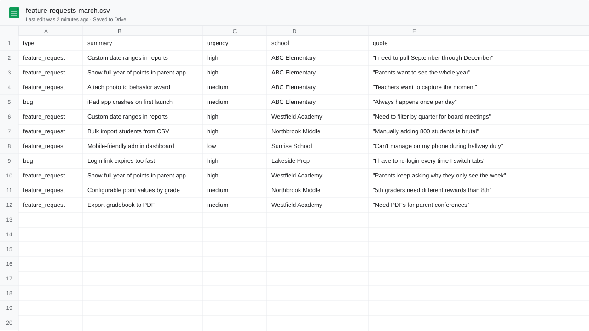
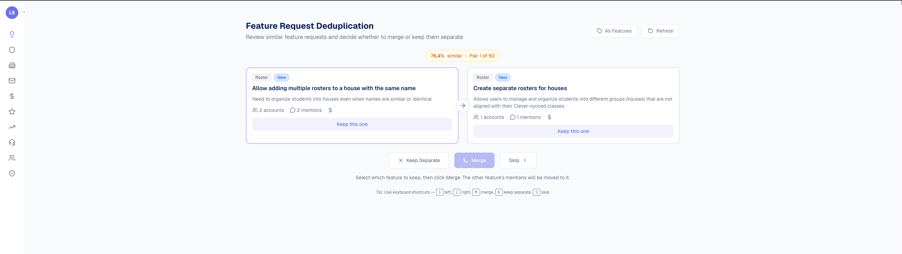
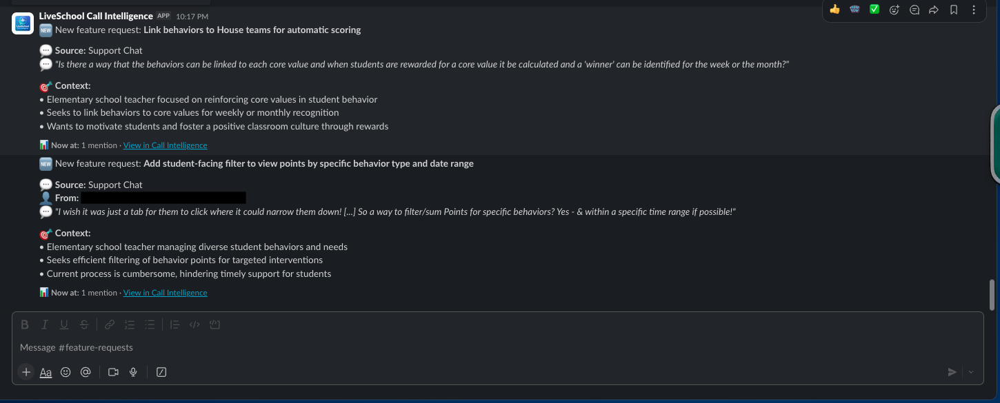

# Case Study: How Call Intelligence got built
{: .no_toc }

A linear story of how a non-engineer (me, Laura) turned a frustrating manual workflow into a working internal tool, built on evenings and weekends, with Claude Code writing essentially all the code. Real timeline, real mistakes, real prompts.
{: .fs-5 .fw-300 }

**TL;DR**

- **What I built:** Call Intelligence, a tool that reads every customer call/email/chat/survey and extracts feature requests automatically, pulling out the asks that never made it into our [Canny](https://canny.io) feature board
- **How:** Next.js + Supabase + Vercel Cron + OpenRouter, all written by [Claude Code](https://claude.ai/code) over a few months of evenings
- **Why:** It's the next chapter of the CS↔Product feedback loop I [first wrote about in 2023](https://gaingrowretain.com/kb/articles/116-how-to-create-an-effective-feedback-loop-between-customer-success-and-product-teams). Same problem (feedback gets lost between customers and the roadmap), now with an automated solution
- **Status:** Working internal tool, used weekly by me and referenced by leadership; broader team rollout still in progress

<strong>Table of contents</strong>

1. TOC
{:toc}

---

## The problem (before I built anything)

I work at [LiveSchool](https://whyliveschool.com/), an EdTech company. We make a behavior management tool used by thousands of K-12 schools. Like every SaaS company, we have customer success calls, support tickets, NPS surveys, sales conversations. Customers told us what they wanted constantly.

**And we kept losing it.**

A principal would mention on a renewal call that she desperately needed a custom date range in reports. The CS manager would say *"oh yeah, we've heard that a lot."* If she remembered, she'd go log it in [Canny.io](https://canny.io) later that day. Canny was the system we'd built for tracking feature requests, and [I wrote about how we set it up in 2023](https://gaingrowretain.com/kb/articles/116-how-to-create-an-effective-feedback-loop-between-customer-success-and-product-teams). If she didn't remember, the ask was gone.

Across our team, *most* asks didn't make it into Canny. Calls were busy, the moments came fast, and logging feedback into a separate tool was always somebody's second priority. Product was prioritizing based on the loudest internal voice rather than the data, because the data we *had* was incomplete by design.

I wanted to fix that. I'm not a software engineer. I knew SQL well enough to write a basic query and HTML well enough to embarrass myself. **I had never built anything close to what Call Intelligence is now.**

---

## Phase 1: Claude Desktop, by hand (2 weeks)

The first version of Call Intelligence wasn't software. It was a habit.

Every week, our CS team had 30-40 calls. We were already getting auto-generated transcripts from [Fireflies AI](https://fireflies.ai). I opened Claude Desktop, copied a transcript in, and typed something close to what's in [the 101 page](../101-your-first-ai-tool/#step-2-your-first-extraction):

> Extract every distinct feature request, bug, or piece of feedback from this transcript. Return as JSON with type, summary, detail, urgency, category, quote.

I did that for two weeks. Maybe 60 calls total, by hand, in a Notion page.

**Two weeks in, I had something Canny couldn't give us.** A list of customer asks pulled straight from call transcripts, including the ones that had been mentioned on calls but never gotten logged into Canny, plus verbatim customer quotes for the ones we already knew about. I shared it in a 1:1 with Matt. A meaningful chunk was brand new to him. The rest had useful context attached that we'd never captured. **That's when I knew it was worth building.**

{: .story }
> **The lesson:** I almost skipped this phase. I almost jumped straight into "build a real tool." If I had, I would have built the wrong tool. I would have optimized for things that turned out not to matter (which sources to ingest, what fields to extract) and missed the things that *did* matter (deduplication, source linking, presenting evidence cleanly). Two weeks of doing it by hand is what told me what to build.

---

## Phase 2: The first script (one weekend)

The manual workflow didn't scale. Fireflies was producing more transcripts than I could process by hand, and my Notion page was a mess.

That weekend I:

1. Asked Claude (in Claude Desktop) to teach me about the Fireflies API
2. Got a Claude API key from `console.anthropic.com`
3. Installed Claude Code
4. Asked Claude Code to write me a Node script that:
   - Pulled the last 50 Fireflies transcripts via their API
   - Ran each through the same prompt I'd been using by hand
   - Dumped the results into a CSV

**The first version was about 80 lines of code.** It took me about 6 hours to get it working end-to-end, including the 4 hours I spent confused about why my `.env` file wasn't being read. (Spoiler: it was named `env`, not `.env`. The leading dot matters.)

I ran the script. It produced a 400-row CSV. I opened it in Google Sheets. **I did not share it with the team.** I wanted to sit with it for a week first, see whether the extractions held up, see what was missing from Canny vs. what was duplicated, see whether the categories Claude assigned matched the categories my own brain would have used.

They mostly did. There was noise. Sometimes Claude would tag the same thing two different ways across two calls, or split one ask into three. But the bones were right. And every time I scanned the sheet I'd find at least one ask we'd genuinely never logged.

I kept building, quietly.

*Illustrative. The first features.csv. Crude. No formatting, no filters, no summary view. The novelty wasn't a feature list (we had one in Canny). It was capturing the asks from calls and emails that had never made it into Canny, and pairing every entry with a verbatim customer quote.*

---

## Phase 3: The first dashboard (a week of evenings, still private)

A CSV in Google Sheets is fine for a few days. Then *I* started wanting filters, sorting, the ability to mark features as "shipped" or "in progress" so I could re-run the script without losing my own state. The friction was small but it stacked.

I asked Claude Code to:

1. Spin up a Next.js app
2. Use Supabase as the database (replacing the CSV)
3. Create the basic tables: `features` and `mentions`
4. Build a one-page dashboard listing features sorted by mention count

This took me about 8 evening-hours total over a week. **I had never touched Next.js or Supabase before.** Claude Code walked me through every step.

By the end:

- Live URL on Vercel
- Google sign-in (only `@liveschoolinc.com` could log in)
- A table of features with mention counts, last-seen date, source links, and category filters

**I still didn't broadcast it.** I quietly showed it to leadership, the one person I trusted to react honestly to a half-built thing, and they started referencing it in our product conversations. That was the signal that this was worth more investment.

Broader team adoption is still rolling out as I write this. It's not the moment-of-launch narrative I expected to be writing. It's slower, more deliberate, more "did anyone find this useful this week?" The honest version: a tool only matters once people actually use it, and that takes longer than building it.

{: .story }
> **The lesson:** I had a small panic-attack moment after leadership asked if there was "a way to assign each feature to an internal owner so we can track who's responsible for chasing it down." It sounded like a "real software" feature. I assumed it would take me weeks. It took me 45 minutes. Claude Code scaffolded an `owner_id` column, a select dropdown, an API route to update it, and the UI to show owners in the dashboard. **Everything in software seems harder from the outside than it is from the inside, once you have Claude.**

---

## Phase 4: More sources, more pain (a month)

Fireflies covered customer success calls. But customers also send us:

- HubSpot emails (sales + CS threads)
- Intercom chats (in-product support)
- NPS surveys (every quarter, every customer)

Each one needed its own ingestion. Each had its own API, its own auth, its own pagination quirks. Each needed its own `*_sync_state` table to track where the last sync left off.

This was the slog phase. The phase where you realize software has a long tail of integration boilerplate. **Pulling data out of other systems is most of the work in building a system.**

I did this incrementally, one source per weekend:

- **Weekend 1**: HubSpot email sync. The HubSpot API for searching email threads is confusing. Took me longer than expected. Claude walked me through it but I had to actually understand the data model to get it right.
- **Weekend 2**: Intercom sync. Easier; their API is cleaner.
- **Weekend 3**: NPS survey ingestion. Different shape (single short text response, not a transcript), so the extraction prompt had to change. I added a `source_type` field that flows through to the prompt selection.

By the end of the month, four sources flowed in automatically: Fireflies via webhook (real-time, with a Vercel Cron fallback every 6 hours), plus HubSpot, Intercom, and NPS via Vercel Cron on their own schedules. **The dashboard now had ~10,000 mentions in it.**

That was the moment deduplication stopped being optional.

---

## Phase 5: Deduplication (the hardest two weeks)

With 10,000 mentions, you don't have a feature list. You have noise.

The same feature, *"parents want to see their child's full point history"*, was mentioned in 47 calls, 32 emails, 8 chats, and 14 surveys. Each was a separate row. The dashboard showed 100 entries that were all the same thing.

I asked Claude to design a dedup system. Here's the actual chat history from that conversation, paraphrased:

> **Me:** I have 10,000 mentions. Many are about the same underlying feature. I need to deduplicate them. What's the right approach?
>
> **Claude:** A few options, depending on how much LLM cost you want to spend. Cheapest is fuzzy string matching. Most accurate is calling an LLM for every pair. Best balance is usually: embed every summary with a vector model, find nearest neighbors with a similarity threshold, then run an LLM judgment only on the top few candidates per mention. Want me to walk through each?
>
> **Me:** Yes, walk through all three with pros, cons, and rough cost at our scale.

That conversation led to the two-stage approach described in [the 301 page](../301-build-the-real-thing/#two-stage-deduplication). It took two weeks of evenings to:

- Add pgvector embeddings to every feature summary
- Build the candidate-finding query
- Build the LLM judgment prompt and parser
- Build the triage UI for the "maybe" band

The triage UI was the unexpectedly satisfying part. I'd sit down with a coffee, click through 20 candidate pairs, and the dashboard would compress by 200 mentions. Every session made the data cleaner.

*The triage UI in action. Each pair shows similarity score, account/mention counts, and three decisions: merge them, keep them separate, or skip for later.*

{: .story }
> **The lesson:** I tried to be clever first. My initial dedup attempt was "ask Claude to look at every new mention and pick the matching feature from a list of 500 options." It was slow ($$$) and wrong (it would invent matches that weren't there). Embedding-based pre-filtering (boring, mechanical, well-understood) outperformed the clever version by every metric. **The boring solution usually wins.**

---

## Phase 6: Polish, integrations, Slack

The system was working for *me*. Now I started building the things that would make it work for other people, even before those people were actively using it. Some of it was speculative ("when a wider rollout happens, we'll want this"), some of it was responding to actual asks from leadership.

- **Slack notifications** calling out what the customer asked for and the context behind the ask
- **Email integration** so the team could send "we shipped what you asked for" announcements directly from the feature detail page

*A `#feature-requests` channel notification. Every new request lands here automatically with the customer's verbatim quote and a link back to the dashboard. (Currently piped to a narrow channel; broader team rollout still in progress.)*
- **Owner assignment** so each feature has someone on the team tracking it
- **Status workflow** (new → considering → planned → shipped)
- **Customer-facing announcements** for shipped features

Each of these was one to three evenings. The codebase had grown to maybe 5,000 lines but felt manageable because I knew the shape. I could ask Claude Code to find the right file and modify it, and it could.

This phase taught me the most about code organization. Earlier I had everything jammed in one folder; refactoring it into `lib/call-intelligence/{fireflies, hubspot, intercom, gmail, slack, features, nps, autopilot}/` happened during this phase, mostly at Claude Code's suggestion.

---

## Where it is today

- **16 Postgres tables** (`ci_*` prefix, plus shared CRM tables)
- **4 active data sources** flowing in automatically (Fireflies via webhook + cron fallback; HubSpot email, Intercom, NPS via Vercel Cron)
- **~50,000 mentions** processed, deduplicated into ~3,500 canonical features
- **Used weekly by me; referenced by leadership; rolling out to the wider team gradually**
- **~$40/month** in LLM costs (OpenRouter, mostly Haiku for extraction, Sonnet for dedup judgment)
- **~$25/month** in hosting (Vercel + Supabase, both on paid tiers; cron scheduling is included)

It's not a moonshot. It's not even fully launched. It's a working internal tool that's already changing how I think about product feedback, and that I'm steadily wiring into how the rest of the team thinks about it too. **That's the bar I wish people aimed at more.** Most internal tools don't need to be perfect on day one; they need to be useful to *one person* on day one, and improve from there.

---

## What I'd do differently

A few things, in order of how much pain they would have saved me.

### 1. Start with the data model, not the UI

I spent the first weekend on a beautiful dashboard with data that didn't fit it. The schema kept changing. The dashboard kept breaking. **Spend the first day asking Claude to design the schema. Argue with it. Push back on every choice.** Once the schema is right, the UI becomes obvious.

### 2. Set up TypeScript and tests on day one

I didn't. I told myself "I'll add them later when it matters." That was wrong. By the time it mattered, retrofitting them was painful. **Ask Claude Code to scaffold TypeScript + a basic test setup as part of your initial project structure.** It's two prompts. It'll save you a month of confidence-erosion later.

### 3. Build the "what's broken right now" view before you have things break

A sync job that silently fails for three days is a special kind of pain. I added a sync health dashboard much too late, after I'd already missed data twice. **As soon as you have a scheduled job, ask Claude to add a "sync runs" table and a page that shows status.**

### 4. Don't trust your own dedup eyeballs

I spent a long time tweaking similarity thresholds based on "what feels right." It would have been more efficient to dump 200 candidate pairs into a spreadsheet, mark each one "match / not / unsure" myself, and use *that* to calibrate. **Build a labeled eval set for any subjective judgment in your system.**

### 5. Don't put off the integrations that scare you

I dragged my feet on HubSpot for two weeks because their API documentation was confusing. When I finally sat down with Claude Code and asked it to walk through the doc, the integration was done in three hours. **Things look scarier from the outside than they are from the inside, every time.**

---

## What I want you to take from this

Three things:

1. **The hardest part is starting.** Two weeks of pasting transcripts into Claude Desktop by hand is what told me what to build. If I'd skipped that I would have built the wrong thing.

2. **Direction beats expertise.** I am not a software engineer. Claude Code wrote essentially all the code. My job was to know what I wanted and to recognize when the output was wrong. That's a skill anyone can learn.

3. **Internal tools are the right starting place.** Don't try to build the next Notion. Build the thing your own team needs that's currently a manual Google Sheet. Internal tools have a forgiving user base (your coworkers), a defined problem (the manual thing they hate), and a fast feedback loop (you sit next to them). **They're the perfect on-ramp.**

---

## If this resonated

You have three options from here:

[Start the 101 (30 minutes)](../101-your-first-ai-tool/){: .btn .btn-primary .fs-5 .mr-2 }
[Want to chat? Book time](https://liveschoolapp.com/bc/book/chat-with-laura-liveschool){: .btn .fs-5 .mr-2 }
[See the resources](../resources/){: .btn .fs-5 }

- **If you're curious whether you could do this:** start the [101](../101-your-first-ai-tool/). Thirty minutes will tell you whether it's for you.
- **If you're a CS leader thinking through your own version:** [grab time on my calendar](https://liveschoolapp.com/bc/book/chat-with-laura-liveschool). I'm happy to talk through what worked, what didn't, and where to start. Or message me on [LinkedIn](https://www.linkedin.com/in/lauralitton/).
- **If you want to see the broader tooling:** the [Resources page](../resources/) has every link, glossary entry, and prompting pattern I've collected.

The hard part isn't the code.

---

<a href="../301-build-the-real-thing/">← 301</a>
<a href="../resources/">Resources →</a>

