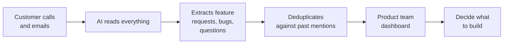

# You don't need to know how to code.
{: .fs-9 }

I'm the VP of Success at an EdTech company. A year ago, I'd never written a real program. Today, the tool I'm about to show you — **Call Intelligence** — reads every customer call, extracts every feature request, and gives our product team a live roadmap of what customers actually want.
{: .fs-5 .fw-300 }

I built it by talking to Claude.

  

    
  

  

    
Laura Litton

    
VP of Success · LiveSchool

  

<a href="docs/101-your-first-ai-tool/" class="btn btn-primary mr-2">Start at the very beginning →</a>
<a href="docs/case-study/" class="btn">See the case study</a>

  

    
4

    
customer data sources flowing in automatically

  

  

    
50K+

    
customer mentions extracted and deduplicated

  

  

    
0

    
lines of code I wrote by hand

  

<figure class="hero-image">
  
</figure>

The live Call Intelligence dashboard. Every row is a deduplicated feature request, sorted by how many customers have asked for it.

---

## Pick your starting point

The guide is layered. Pick the layer that matches your patience and ambition right now. You can come back for the next one whenever.

  

    101 · Beginner
    
Your first AI tool

    
⏱ 30 minutes &nbsp;·&nbsp; Never used Claude

    
A working AI extraction running in Claude Desktop on a real call transcript. You'll know whether this is worth more of your time.

    <a class="level-card-cta" href="docs/101-your-first-ai-tool/">Start here →</a>
  

  

    201 · Intermediate
    
Make it real

    
⏱ A weekend &nbsp;·&nbsp; Has a GitHub account

    
A tiny app running on your laptop. Paste a transcript in one side, see a clean table of feature requests come out the other.

    <a class="level-card-cta" href="docs/201-make-it-real/">Read 201 →</a>
  

  

    301 · Advanced
    
Build the real thing

    
⏱ A few weeks &nbsp;·&nbsp; Wants the full thing

    
Your own deployed version of Call Intelligence. Real database, scheduled jobs, live dashboard, real users.

    <a class="level-card-cta" href="docs/301-build-the-real-thing/">Read 301 →</a>
  

Inside each layer, anything you don't want to read is hidden behind a toggle. The visible path is short. The deep path is one click away.

---

## Why this exists

In May 2023, I wrote [a blog post for Gain Grow Retain](https://gaingrowretain.com/kb/articles/116-how-to-create-an-effective-feedback-loop-between-customer-success-and-product-teams) about how to build a working feedback loop between Customer Success and Product teams.

The short version: when I started as Director of Success at LiveSchool, our system for tracking customer feature requests was a mess of Airtable rows, Intercom tags, and gut-feel anecdotes. The Product team couldn't tell which features were actually being asked for most often. The Success team couldn't tell what was in the pipeline. **No one had a real signal — just noise.**

So I got us onto [Canny.io](https://canny.io), set up a monthly cadence with Product, and pulled everyone — Success, Sales, Marketing — into the habit of logging requests in one place. The article walks through the five things that mattered: centralize requests, establish clear meeting cadences, choose the right tool, train people on it, and add prioritization beyond raw vote counts.

Canny worked. It still works.

**The bottleneck Canny didn't solve**

A central repository only helps if the requests actually make it in. Sales hears something on a demo. Support gets it in a chat. The CS team learns about it on a renewal call. Unless someone remembers to log it — *and finds the right ticket, and writes a clean summary, and tags it correctly* — it's gone.

Years into running that system, I watched it get partly skipped every single week. Not because anyone was lazy. Because logging feedback into a separate tool, in the middle of a customer conversation, just isn't where humans put their energy.

**Call Intelligence is the next version of that feedback loop.** Instead of asking humans to manually log feature requests, it reads every customer conversation automatically — Fireflies transcripts, HubSpot emails, Intercom chats, NPS surveys — and uses Claude to extract every request, label it, deduplicate it against past mentions, and put it in front of the Product team with verbatim evidence.

The bottleneck moves from *"do humans remember to log this?"* to *"do customers say it at all?"* — which is a much smaller, much more solvable problem.

This guide is how you build your own version, even if you've never written code before.

---

## How it works

The flow, in plain English:

Calls come in from four sources (Fireflies, HubSpot emails, Intercom chats, NPS surveys). Claude reads each one and pulls out structured items. A simple matching algorithm groups duplicate mentions of the same feature. The dashboard shows the product team what customers actually want, with evidence.

That's it. The whole thing.

But it's not really about Call Intelligence. It's about a method: **describe what you want, let Claude write the code, and learn just enough to direct it intelligently.**

---

## A note before you start

The hard part of building software isn't the code. The hard part is **knowing what you want and explaining it clearly.** If you can write a clear email describing a problem, you can build software with Claude.

You're going to make mistakes. You're going to ask Claude for something and get back code that doesn't work. You're going to spend an hour confused before realizing you forgot to save a file. **All of that is normal.** It happened to me too. It still happens to me.

Ready? [Start with the 101 →](docs/101-your-first-ai-tool/){: .btn .btn-primary }

---

<small>
Questions or want to chat? Find me on <a href="https://www.linkedin.com/in/lauralitton/">LinkedIn</a>, email <a href="mailto:laura@liveschoolinc.com">laura@liveschoolinc.com</a>, or <a href="https://liveschoolapp.com/bc/book/chat-with-laura-liveschool">grab time on my calendar</a> — which I also built with Claude Code.
  
Source for this guide is on <a href="https://github.com/llitton/build-with-claude">GitHub</a>.
</small>
