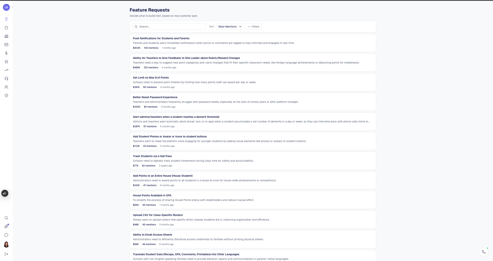
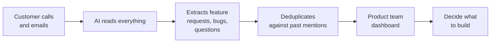

# You don't need to know how to code.
{: .fs-9 }

I'm the VP of Success at an EdTech company. A year ago, I'd never written a real program. Today, the tool I'm about to show you — **Call Intelligence** — reads every customer call, extracts every feature request, and gives our product team a live roadmap of what customers actually want.
{: .fs-5 .fw-300 }

I built it by talking to Claude.

  

    
  

  

    
Laura Litton

    
VP of Success · LiveSchool

  

<a href="docs/101-your-first-ai-tool/" class="btn btn-primary mr-2">Start at the very beginning →</a>
<a href="docs/case-study/" class="btn">See the case study</a>

  

    
4

    
customer data sources flowing in automatically

  

  

    
50K+

    
customer mentions extracted and deduplicated

  

  

    
0

    
lines of code I wrote by hand

  

<figure class="hero-image">
  
</figure>

The live Call Intelligence dashboard. Every row is a deduplicated feature request, sorted by how many customers have asked for it.

---

## Pick your starting point

The guide is layered. Pick the layer that matches your patience and ambition right now. You can come back for the next one whenever.

  <a class="level-card level-card-101" href="docs/101-your-first-ai-tool/">
    101 · Beginner
    <h3 class="level-card-title">Your first AI tool</h3>
    
⏱ 30 minutes &nbsp;·&nbsp; Never used Claude

    
A working AI extraction running in Claude Desktop on a real call transcript. You'll know whether this is worth more of your time.

    
Start here →

  </a>
  <a class="level-card level-card-201" href="docs/201-make-it-real/">
    201 · Intermediate
    <h3 class="level-card-title">Make it real</h3>
    
⏱ A weekend &nbsp;·&nbsp; Has a GitHub account

    
A tiny app running on your laptop. Paste a transcript in one side, see a clean table of feature requests come out the other.

    
Read 201 →

  </a>
  <a class="level-card level-card-301" href="docs/301-build-the-real-thing/">
    301 · Advanced
    <h3 class="level-card-title">Build the real thing</h3>
    
⏱ A few weeks &nbsp;·&nbsp; Wants the full thing

    
Your own deployed version of Call Intelligence. Real database, scheduled jobs, live dashboard, real users.

    
Read 301 →

  </a>

Inside each layer, anything you don't want to read is hidden behind a toggle. The visible path is short. The deep path is one click away.

---

## Why this exists

Every customer success team is sitting on a goldmine of product feedback they can't quite use. Calls happen. Customers ask for things. The CS rep promises to "pass it along." Sometimes it gets to product. Usually it gets lost — buried in a Slack thread, mentioned once in a 1:1, or summarized into oblivion by the time anyone with priority-setting authority hears it.

**The broader context**

This is the classic CS↔Product feedback loop problem. [Gain Grow Retain has a great primer on it](https://gaingrowretain.com/kb/articles/116-how-to-create-an-effective-feedback-loop-between-customer-success-and-product-teams) — the short version is: when customer-facing teams and product teams aren't tightly connected, customers shout requests in, insights come out at random, and product prioritization ends up based on the loudest internal voice rather than the data.

**Call Intelligence is a concrete answer to that question.** It's the implementation behind "create a structured feedback loop." Built by a CS leader, for a CS team, with evidence flowing straight from every customer conversation into a product-facing dashboard.

This guide is how you build your own version — even if you've never written code before.

---

## How it works

The flow, in plain English:

Calls come in from four sources (Fireflies, HubSpot emails, Intercom chats, NPS surveys). Claude reads each one and pulls out structured items. A simple matching algorithm groups duplicate mentions of the same feature. The dashboard shows the product team what customers actually want, with evidence.

That's it. The whole thing.

But it's not really about Call Intelligence. It's about a method: **describe what you want, let Claude write the code, and learn just enough to direct it intelligently.**

---

## A note before you start

The hard part of building software isn't the code. The hard part is **knowing what you want and explaining it clearly.** If you can write a clear email describing a problem, you can build software with Claude.

You're going to make mistakes. You're going to ask Claude for something and get back code that doesn't work. You're going to spend an hour confused before realizing you forgot to save a file. **All of that is normal.** It happened to me too. It still happens to me.

Ready? [Start with the 101 →](docs/101-your-first-ai-tool/){: .btn .btn-primary }

---

<small>Source for this guide and Call Intelligence are both on <a href="https://github.com/llitton">GitHub</a>. Questions? Open an issue.</small>
