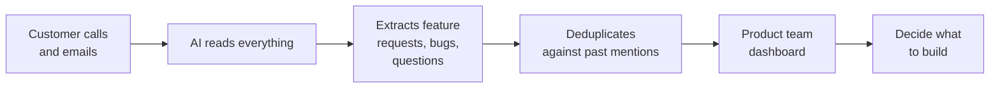

# You don't need to know how to code.
{: .fs-9 }

I'm not a software engineer. I'm the VP of Success at an EdTech company. A year ago, I'd never written a real program. Today, the tool I'm about to show you — **Call Intelligence** — processes hundreds of customer calls a week, extracts every feature request, deduplicates them against past mentions, and gives our product team a live roadmap of what customers are actually asking for.
{: .fs-5 .fw-300 }

I built it by talking to Claude.
{: .fs-5 .fw-300 }

[Start at the very beginning](docs/101-your-first-ai-tool/){: .btn .btn-primary .fs-5 .mb-4 .mb-md-0 .mr-2 }
[See the case study](docs/case-study/){: .btn .fs-5 .mb-4 .mb-md-0 }

---

## What this guide is

This is a step-by-step walkthrough of how a non-engineer (me) built a real software tool that real product managers use every week. The case study is **Call Intelligence**, a tool I built for LiveSchool that reads customer calls, extracts feature requests, and feeds them into a dashboard.

But it's not really about Call Intelligence. It's about a method: **describe what you want, let Claude write the code, and learn just enough to direct it intelligently.**

You're going to leave this guide with one of three things:

### 🟢 You finish the 101 (30 minutes)
You'll have used Claude to extract structured data from a real call transcript. You'll understand what "AI tooling" actually means in practice. You'll know whether this is worth more time.

### 🟡 You finish the 201 (a weekend)
You'll have built a tiny working web app. Paste a transcript in one side, see a clean table of feature requests come out the other. It'll live on your laptop. You'll understand what files, repos, and "running code" actually mean.

### 🔴 You finish the 301 (a few weeks)
You'll have built your own version of Call Intelligence. Real database, scheduled jobs that pull in new calls automatically, a live dashboard, real users. You'll understand the architecture of a small SaaS app — and you'll have built one.

---

## How to read this

The guide is layered. Pick the layer that matches your patience and ambition right now. You can come back for the next one whenever.

| Layer | Who it's for | Time | What you'll have at the end |
|---|---|---|---|
| [**101 — Your first AI tool**](docs/101-your-first-ai-tool/) | Never used Claude. Doesn't code. Curious. | 30 minutes | A working AI extraction running in Claude Desktop |
| [**201 — Make it real**](docs/201-make-it-real/) | Comfortable in 101. Has a GitHub account. | A weekend | A tiny web app running on your laptop |
| [**301 — Build the real thing**](docs/301-build-the-real-thing/) | Wants the full Call Intelligence. | A few weeks | Your own version of the live tool, deployed |

Inside each layer, anything you don't want to read is hidden behind a toggle. The visible path is short. The deep path is one click away.

---

## What Call Intelligence actually does

Here's the tool we're building toward. Don't worry about understanding it yet — this is just so you can see the destination.

*A screenshot of the live dashboard goes here. (Coming soon.)*

**The flow, in plain English:**

Calls come in from four sources (Fireflies, HubSpot emails, Intercom chats, NPS surveys). Claude reads each one and pulls out structured items. A simple matching algorithm groups duplicate mentions of the same feature. The dashboard shows the product team what customers actually want, with evidence.

That's it. The whole thing.

---

## A note before you start

The hard part of building software isn't the code. The hard part is **knowing what you want and explaining it clearly.** If you can write a clear email describing a problem, you can build software with Claude.

You're going to make mistakes. You're going to ask Claude for something and get back code that doesn't work. You're going to spend an hour confused before realizing you forgot to save a file. **All of that is normal.** It happened to me too. It still happens to me.

Ready? [Start with the 101 →](docs/101-your-first-ai-tool/){: .btn .btn-primary }

---

<small>Source for this guide and Call Intelligence are both on <a href="https://github.com/lauralitton">GitHub</a>. Questions? Open an issue.</small>
